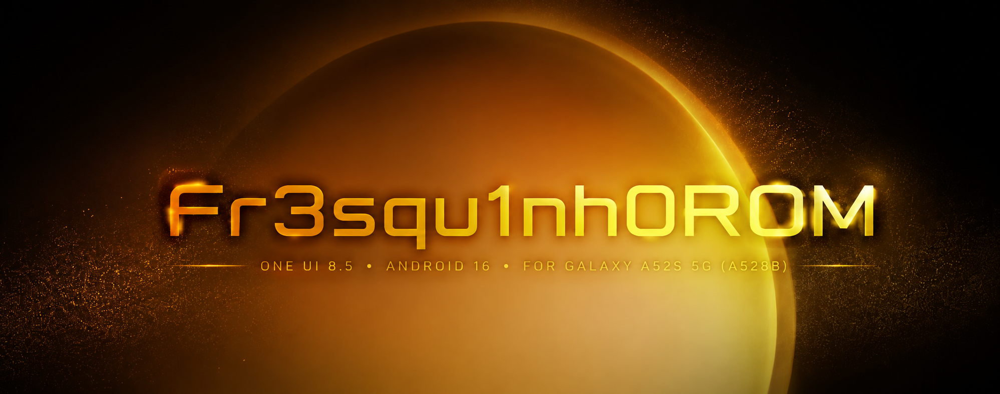

# Fr3squ1nh0ROM
One UI 8.5 / Android 16 port for the Samsung Galaxy A52s 5G, focused on performance, stability and hardware compatibility.

  

  One UI 8.5 • Android 16 • Samsung Galaxy A52s 5G

---

## 📱 About

**Fr3squ1nh0ROM** is a community-driven project focused on
porting and adapting the One UI 8.5 experience to the
Samsung Galaxy A52s 5G (SM-A528B / a52sxq).

The goal is to bring a modern One UI experience to the A52s
while maintaining hardware compatibility, stability,
performance and daily-driver usability.

> 🚧 **Pre-release / Early Development**
>
> No public ROM release is available yet.

---

## 🎯 Goals

- Bring One UI 8.5 / Android 16 to the Galaxy A52s 5G
- Preserve the Samsung One UI experience
- Maintain compatibility with the A52s hardware
- Provide smooth and responsive animations
- Optimize performance, thermals and battery life
- Preserve Samsung features where possible
- Add custom Fr3squ1nh0ROM features
- Achieve a stable SELinux Enforcing configuration
- Build a reliable daily-driver experience

---

## 🛠️ Development

Current development is focused on adapting the One UI 8.5
software stack to the Galaxy A52s platform.

### Low-level

- Linux kernel 5.4.302
- A52s device tree
- Prebuilt DTBO
- Snapdragon 778G platform

- ### Software

- - One UI 8.5
- Android 16 / QPR2 base
- Samsung framework adaptation
- System / Product / System_ext adaptation
- Hardware compatibility
- SELinux policy adaptation

---

## 🗺️ Roadmap

### Phase 1 — Bring-up

- [ ] First boot
- [ ] ADB
- [ ] SystemUI
- [ ] Basic UI functionality
- [ ] Initial debugging and logging

### Phase 2 — Hardware

- [ ] Display
- [ ] Touch
- [ ] Audio
- [ ] Wi-Fi
- [ ] Bluetooth
- [ ] Camera
- [ ] Fingerprint
- [ ] Telephony
- [ ] 5G
- [ ] Sensors

### Phase 3 — Stability

- [ ] SELinux Enforcing
- [ ] Thermal management
- [ ] Battery optimization
- [ ] Memory management
- [ ] Power management

### Phase 4 — Fr3squ1nh0 Features

- [ ] Fr3squ1nh0 Settings
- [ ] Animation speed controls
- [ ] Refresh-rate controls
- [ ] Battery health and cycle information
- [ ] OTA information
- [ ] Additional system customization

### Phase 5 — Release

- [ ] Internal testing
- [ ] Alpha
- [ ] Beta
- [ ] Stable release

---

## 📱 Target Device

 Device | Model | Codename |
|---|---|---|
| Samsung Galaxy A52s 5G | SM-A528B | a52sxq |

---

## 📂 Repository

This repository contains the open-source development
components, source code and documentation of Fr3squ1nh0ROM.

Proprietary Samsung firmware, vendor binaries, blobs and
applications are not redistributed in this repository.

---

## ⚠️ Disclaimer

Fr3squ1nh0ROM is an independent community project and is not
affiliated with or endorsed by Samsung Electronics.

Samsung, Galaxy and One UI are trademarks of their respective
owners.

This project does not redistribute proprietary Samsung
software or firmware.

---

## 🚧 Project Status

**Pre-release / Early Development**

Development is ongoing. Features listed in the roadmap are
planned and may change during development.

---

## 👨‍💻 Development

Fr3squ1nh0ROM is being developed with the goal of creating a
modern, optimized and community-driven One UI experience for
the Galaxy A52s 5G.

More documentation will be added as development progresses.
